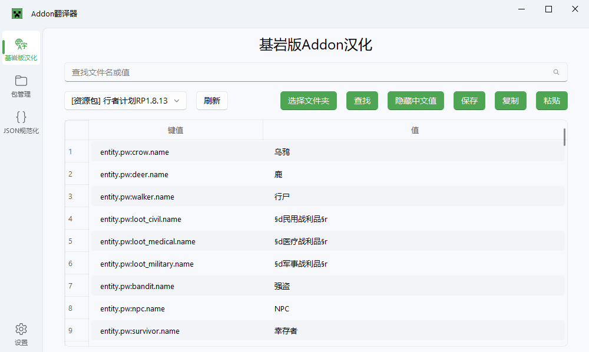

# Minecraft Addon Toolkit (Minecraft Addon工具箱)

[](https://www.python.org/) [](https://www.riverbankcomputing.com/software/pyqt/) [](https://opensource.org/licenses/MIT)

一款为 Minecraft 基岩版 (Bedrock Edition) 开发者与汉化者设计的一站式桌面应用工具箱。它提供了强大的汉化、包管理和文件处理功能，旨在简化 Addon 的开发与维护流程。



---

## ✨ 主要功能 (Features)

### 1. 强大的汉化模块
- **智能扫描**: 自动扫描行为包与资源包，深度查找所有可翻译的文本内容，包括：
  - `.lang` 语言文件
  - 物品 (`items`) 和实体 (`entities`) 的名称与描述
  - 脚本 (`scripts`) 中的对话、按钮文本 (`dialogue`, `button`, `rawtext`)
  - `.mcfunction` 文件中的 `say` 和 `tellraw` 命令
- **可视化编辑**: 在清晰的表格中直接编辑原文与译文，支持换行符。
- **高效工作流**:
  - **快速定位**: 支持按文件名、键或值进行模糊搜索。
  - **专注未译**: 一键隐藏/显示已包含中文的条目，让你专注于未完成的工作。
  - **批量操作**: 支持从剪贴板批量复制和粘贴翻译条目 (`key=value` 格式)。

### 2. 便捷的包管理
- **一键导入**: 支持从 `.zip`, `.mcpack`, `.mcaddon` 文件导入包，并自动归类到行为包或资源包目录。
- **轻松管理**: 在界面中直接对包进行重命名（自动更新`manifest.json`）和删除。
- **Addon 合成**: 只需选择一个行为包和一个资源包，即可将它们合成为一个标准的 `.mcaddon` 文件，方便分享和分发。

### 3. 实用的辅助工具
- **JSON 规范化**: 自动扫描并修复不规范的 JSON 文件（例如，修复由手动编辑产生的尾随逗号、注释等错误），确保 Addon 能够被游戏正确加载。
- **文件定位**: 在汉化表格中双击文件名，可直接在系统的文件资源管理器中打开并选中该文件。

### 4. 优秀的用户体验
- **现代化界面**: 基于 `qfluentwidgets` 库，提供美观流畅的 Fluent Design 风格界面。
- **个性化主题**: 支持浅色、深色模式，并可跟随系统设置自动切换。
- **流畅不卡顿**: 所有耗时操作（如查找、导入、合成）均在后台线程中执行，保证了界面的流畅响应。

---

## 🛠️ 技术栈 (Technology Stack)

- **核心框架**: Python 3
- **图形界面 (GUI)**: PyQt6
- **UI 组件库**: [qfluentwidgets](https://github.com/zhiyiYo/PyQt-Fluent-Widgets) - 一个基于 PyQt/PySide 的 Fluent Design 组件库。
- **JSON 处理**:
  - `orjson`: 用于高性能的 JSON 解析。
  - `json5`: 用于解析和处理不严格的 JSON 文件（例如带注释的 JSON）。
- **文件操作**: `os`, `shutil`, `zipfile` 等 Python 标准库。

---

## 🚀 安装与运行 (Getting Started)

### 环境要求
- Python 3.8+
- Git

### 安装步骤

1.  **克隆仓库**
    ```bash
    git clone https://github.com/smileheart0708/Minecraft-Addon-Toolkit.git
    cd Bedrock-Addon-Toolkit
    ```

2.  **创建 `requirements.txt` 文件** (如果项目中还没有)
    在项目根目录下创建一个名为 `requirements.txt` 的文件，并填入以下内容：
    ```txt
    PyQt6
    qfluentwidgets
    orjson
    json5
    ```

3.  **安装依赖**
    ```bash
    pip install -r requirements.txt
    ```

4.  **运行程序**
    ```bash
    python main.py
    ```

---

## 📄 许可证 (License)

本项目采用 [MIT License](LICENSE) 开源许可证。

Copyright (c) 2025 Smileheart

---

## 🙏 致谢 (Acknowledgements)

- 感谢 [zhiyiYo](https://github.com/zhiyiYo) 开发了如此出色的 `qfluentwidgets` 库。
